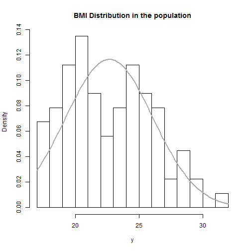

# BMI Calculation
### What's your BMI?

Pevals OTOTO

<i>Coursera Data Product Course Participant</i>

--- .class #define

  <h3>1. What is it?</h3>
  Body mass index (BMI) is a simple index of weight-for-height that is commonly used to classify overweight and obesity in adults. 

--- .class #why
  <h3>2.Why should I care?</h3>
   The BMI is the tool most commonly used to estimate overweight and obesity. 

--- .class #how

  <h3>3.How to calculate?</h3>
   BMI is the calculation of weight (kilos) divided by height squared.
   
   

--- .class #mine
## Use the web app to get your BMI

https://pevals.shinyapps.io/DataProduct/
##      
1. Input your weight and height on the left panel
2. Your BMI will be shown on the right
3. Check your BMI range in the reference table on the left

